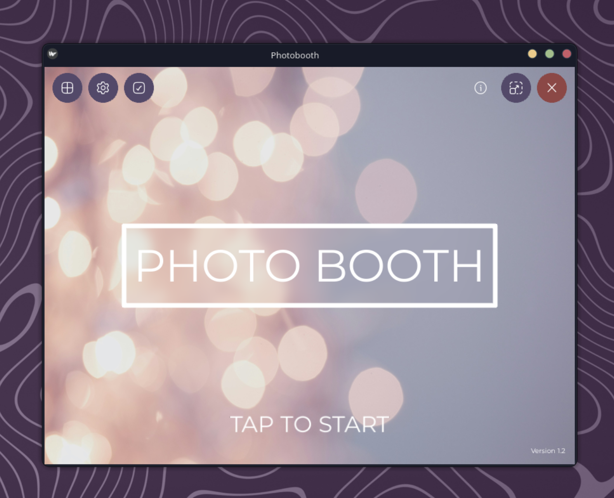
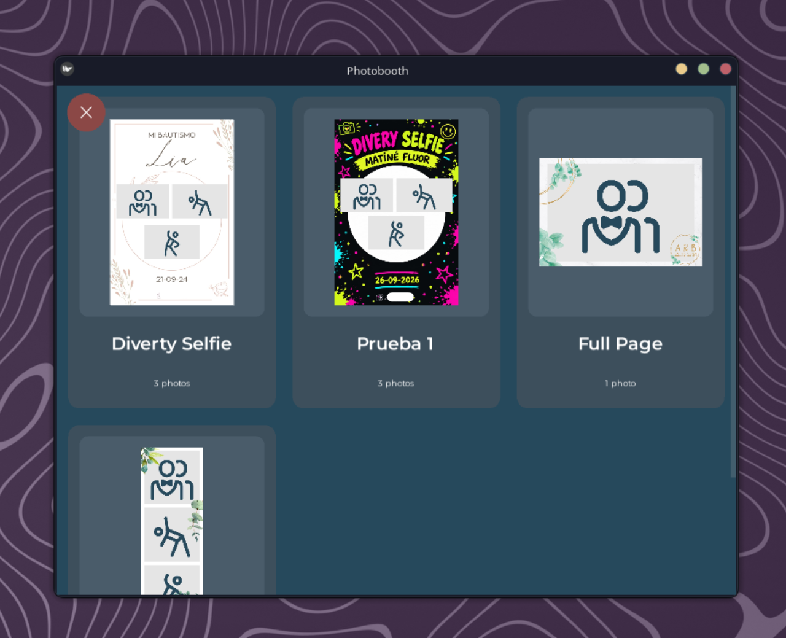
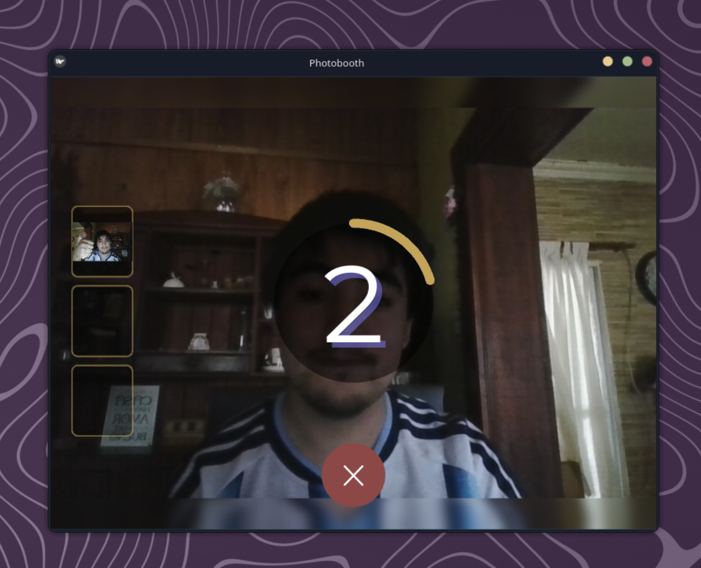
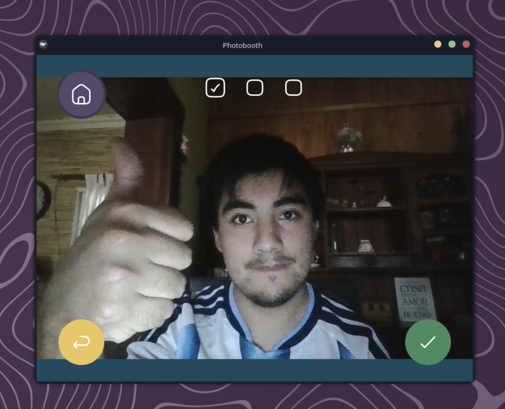
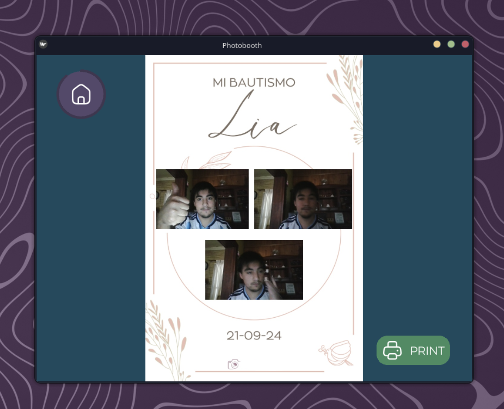
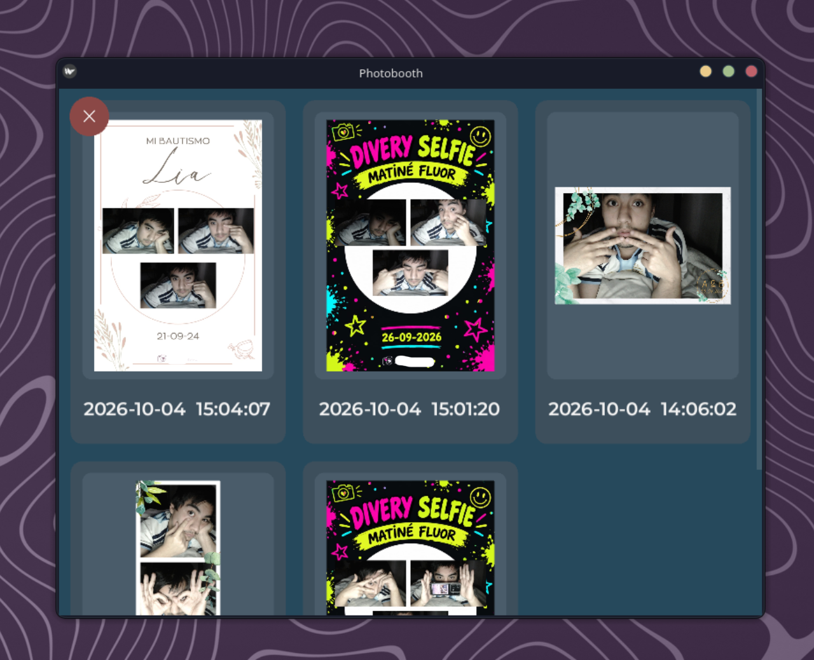

# Simple PhotoBooth

A simple, robust, and intuitive photobooth application designed to be straightforward and accessible for everyone, including children. Built with Python and Kivy, this project provides a streamlined photo-taking experience without unnecessary complexity, suitable for events, parties, DIY kiosks, and photobooth projects.

> [!NOTE]
> This project is published at [https://github.com/Volteretas/py-photobooth-simple](https://github.com/Volteretas/py-photobooth-simple), based on the original upstream work by [IArchi](https://github.com/IArchi/py-photobooth-simple).

## Features

- **Multi-Camera Support & Auto-Fallback:** Code support for Raspberry Pi Camera Module 3, DSLR cameras (via gPhoto2), and USB webcams (OpenCV V4L2). Features automatic camera discovery, manual camera selection (by name, port, or path), and graceful automatic fallback if a preferred camera is disconnected.
- **Direct Standby & Persistent Templates:** Fast guest turnaround with instant camera preview right from the start screen using the active template. Template choices are automatically persisted across reboots (`DCIM/.last_template`).
- **Dynamic Multi-Shot Templates:** Support for templates requiring any number of photos (1, 2, 3, 4, or more). Progress indicators and capture sequences adapt dynamically to `total_shots`.
- **Live Preview Thumbnails:** On-screen thumbnail slots display previous captures during multi-shot sessions, dynamically scaling and preserving their exact aspect ratio (`fit_mode='contain'`) upon window or screen resizing.
- **Review Slideshow with Smooth Crossfade:** Automated post-capture presentation that sequentially projects each individual photo with a smooth dual-layer crossfade before settling on the final collage.
- **Direct Printing & Gallery Reprinting:** CUPS printing integration (designed for photo printers such as DNP DS620, Epson L805, or any CUPS-compatible printer) with non-intrusive floating status banners. Past sessions can also be viewed and reprinted from the on-device Gallery.
- **On-Device Gallery & Navigation:** Interactive photo gallery to browse past sessions with timestamps and lightweight thumbnails, featuring a full-screen viewer with previous/next navigation and reprinting.
- **Configurable Feedback:** Optional post-session rating screen (`[Feedback] ENABLED = True/False`) to collect guest opinions (thumbs up/down) or immediately return to standby preview.
- **Web Admin Dashboard:** Password-protected remote management interface (`http://<ip>:5000/admin`) to configure cameras, print limits, slideshow timings, feedback toggle, start screen branding, inspect system logs, and trigger application restarts.
- **Visual Template Editor:** Browser-based drag-and-drop layout designer (`http://<ip>:5000/admin/editor`) to create and customize photo collage templates with live preview and JSON import/export.
- **WiFi & QR Code Sharing:** Built-in web server generating QR codes so guests can download their collages and photos directly to their mobile devices over the local network.
- **Hardware Integration:** WS2812 LED ring visual feedback via SPI and background photo dumping to FAT32 USB flash drives.

## Screenshots

| Start Screen | Select Format / Template |
| :---: | :---: |
|  |  |
| *Tap to start directly into preview, change template, open gallery, or access settings* | *Interactive grid of available templates with responsive previews* |

| Live Preview & Countdown | Confirm Capture |
| :---: | :---: |
|  |  |
| *Live preview with countdown, blurry borders, and dynamic thumbnails* | *Review capture, retake, or confirm with dynamic shot indicators* |

| Review & Print | On-Device Gallery |
| :---: | :---: |
|  |  |
| *Automated slideshow transition to final collage with print button* | *Browse past sessions by date/time, navigate, and reprint collages* |

## Screen Flow

The application follows an intuitive navigation flow with direct camera preview and continuous standby:

```
                            ┌────────────────────────┐
                            │      Start Screen      │
                            │   (Welcome / Kiosk)    │
                            └──┬──────┬───────────┬──┘
             Touch / Keyboard  │      │ Template  │ Gallery
                               ▼      ▼ Button    ▼ Button
     ┌────────────────────────────┐  ┌───────────┐ ┌──────────────┐
┌───►│       CountdownScreen      │  │  Select   │ │   Gallery    │
│    │  (Live Preview / Standby)  │  │  Format   │ │    Screen    │
│    └─────────────┬──────────────┘  └─────┬─────┘ └──────┬───────┘
│                  │ Trigger Capture       │ Select       │ Pick
│                  ▼                       │ & Save       │ Session
│    ┌────────────────────────────┐        │              ▼
│    │     Countdown Running      │        │       ┌──────────────┐
│    │     (Circular Counter)     │        │       │Gallery Detail│
│    └─────────────┬──────────────┘        │       │(Reprint/Nav) │
│                  │ Shot Complete         │       └──────────────┘
│                  ▼                       │
│    ┌────────────────────────────┐        │
│    │    ConfirmCaptureScreen    │        │
│    │  (Dynamic Shot Indicators) │        │
│    └──────┬──────────────┬──────┘        │
│    Retake │              │ Keep          │
│    Shot   │              │ Shot          │
│           │              ▼               │
│           │     [More shots left?]       │
│           │      ├── Yes ───────────────►│ (auto_start next shot)
│           │      └── No                  │
│           │          │ All shots done    │
│           │          ▼                   │
│           │    ┌────────────┐            │
│           │    │ Processing │            │
│           │    │  Collage   │            │
│           │    └─────┬──────┘            │
│           │          │ Saved             │
│           │          ▼                   │
│           │    ┌────────────┐            │
│           │    │   Review   │◄───────────┘
│           │    │ Slideshow  │
│           │    └─────┬──────┘
│           │          │
│           │    ┌─────┴────────────────┐
│           │    │ Actions:             │
│           │    │ • Print (CUPS)       │
│           │    │ • Share (QR Code)    │
│           │    │ • Retake session     │
│           │    └─────┬────────────────┘
│           │          │ Finish / Timeout
│           │          ▼
│           │    [Feedback ENABLED?]
│           │     ├── Yes ──► ┌───────────────┐
│           │     │           │ SuccessScreen │ (Rating 5s)
│           │     │           └───────┬───────┘
│           │     └── No ─────────────┤
│           │                         ▼
└───────────┴─────────────────────────┴────────────────────── (Ready for next guest!)
```

### Screen Descriptions

- **Start Screen (`docs/1.png`):** The welcome kiosk screen. Touching anywhere starts the camera preview immediately using the active template. Quick-access buttons allow changing the template, opening the photo gallery, viewing hardware diagnostics, toggling fullscreen, or launching web admin settings.
- **Select Format Screen (`docs/2.png`):** Displays available print templates (e.g. 10x15 cm single photo, multi-photo collages, 5x15 cm double strips). Selecting a template immediately persists it as the active format and transitions to camera preview. A back button allows cancelling without changing the selection.
- **Countdown Screen (`docs/5.png`):**
  - **Standby Mode (`shot == 0`):** Continuous live camera preview with the active template's aspect ratio. No timeout occurs in standby, keeping the photobooth ready indefinitely.
  - **Capture Mode:** Displays a circular progress counter. For multi-shot templates (1, 2, 3, 4, or more photos), dynamic thumbnail slots appear on the left, displaying previously captured photos in real time while maintaining their aspect ratio (`fit_mode='contain'`) on any window resize. In single-shot templates, thumbnails remain hidden.
- **Confirm Capture Screen (`docs/4.png`):** Shows the captured photo for validation with dynamic indicator icons corresponding to `total_shots` (for 1, 2, 3, 4+ photos). Users can retake the photo or confirm it. Subsequent shots trigger an automatic countdown with debounce protection against accidental touches.
- **Processing Screen:** Asynchronously generates the high-resolution collage, creates lightweight thumbnails, saves images to the gallery structure, and registers statistics.
- **Review Screen (`docs/6.png`):** Automatically plays a slideshow of the individual shots with smooth crossfade transitions before settling on the final collage. Offers non-blocking printing, QR code sharing, retaking, or returning home.
- **Gallery Screen (`docs/3.png`):** On-device gallery displaying past sessions chronologically with timestamps and optimized thumbnails.
- **Gallery Detail Screen:** Full-screen view of any past collage strip with previous/next navigation buttons, QR code sharing, and a direct reprint button to CUPS printers.
- **Success / Feedback Screen:** Optional user rating screen (thumbs up / thumbs down) shown when `[Feedback] ENABLED = True`. If disabled, the application transitions directly back to camera standby.
- **Maintenance / Error Screen:** Displayed when hardware intervention is required (e.g. low disk space, camera failure, or printer issues).

## Camera Support & Fallback

The application supports multiple camera types on Linux:

- **Raspberry Pi Camera Module 3:** Supported via Picamera2 / libcamera.
- **DSLR Cameras via gPhoto2:** Supported in code for compatible Canon, Nikon, and Sony DSLRs via libgPhoto2.
- **USB Webcams via OpenCV:** Standard V4L2 USB webcams.

### Intelligent Camera Selection and Automatic Fallback

- **Automatic Detection (`CAMERA = auto`):** Automatically detects connected V4L2 video devices and gPhoto2 DSLRs non-intrusively via Linux ioctls.
- **Manual Device Selection:** You can specify a camera port index (e.g. `0`, `2`), device path (e.g. `/dev/video0`), or camera name (e.g. `Logitech Webcam C920`) in `config.ini` or via the Web Admin interface.
- **Automatic Fallback:** If the preferred camera fails to open or is disconnected, the system automatically falls back to an available connected camera without crashing.
- **Hybrid Setup Support:** Use a Raspberry Pi Camera or USB webcam for live preview and a DSLR for capture. The preview and capture fields of view can be aligned using the calibration tool:
  ```bash
  python tools/calibrate_zoom.py
  ```

## Gallery & Storage Structure

Photo sessions and collages are saved inside `DCIM_DIRECTORY` (default: `./DCIM`):

```
DCIM/
├── gallery/
│   ├── strips/         # Full-resolution collage strips ({session_id}.jpg)
│   ├── small/strips/   # Lightweight thumbnails for fast gallery browsing ({session_id}_small.jpg)
│   └── photos/         # Raw captured photos ({session_id}_01.jpg, {session_id}_02.jpg, ...)
├── save/               # Session data and statistics (.stats.json)
├── tmp/                # Temporary directory for current session processing
└── .last_template      # Stores the filename of the active template across reboots
```

The application automatically manages disk space, monitors free storage thresholds, and migrates legacy thumbnails into the optimized `gallery/small/strips/` directory on startup.

## Web Admin & Configuration

The application includes an integrated web server running on port `5000` (e.g. `http://<local-ip>:5000`).

### Web Admin Interface (`/admin`)

Protected by `ADMIN_PASSWORD` (configured in `config.ini`), the web admin allows operators to:

- **Manage Configuration:** Update settings (camera device, countdown time, slideshow durations, print limits, feedback screen toggle, UI language) directly from the browser without editing files.
- **Camera Selection:** View all detected V4L2 and gPhoto2 cameras and switch the active camera with one click.
- **Start Screen Customization:** Upload custom background images, toggle titles/instructions, change text colors, and preview changes live.
- **Template Editor:** Access the visual template editor to create or modify templates.
- **System Logs:** View, download, and clear application logs in real time (`/admin/logs`).
- **Statistics & Maintenance:** Monitor disk usage, print counters, session counts, and safely trigger an application restart (`/admin/restart`).

### Visual Template Editor (`/admin/editor`)

The visual template editor is an interactive web-based tool for creating and customizing photo collage layouts without writing code:

- **Visual Canvas:** Drag-and-drop photo frames with grid snapping.
- **Multiple Formats:** Support for 10x15 cm prints, 5x15 cm strips, and custom dimensions.
- **Layers:** Support for custom background graphics and transparent overlay frames.
- **Duplication Support:** Automatically duplicate strips horizontally or vertically for 2-in-1 strip printing.
- **Import / Export:** Save templates as JSON files in the `templates/` folder and export/import layouts easily.


## Compatibility & Hardware Support Status

### Status of Features & Platforms

- **Validated in practice:**
  - Tested on Linux desktop environments (Arch Linux, CachyOS, Ubuntu) with USB webcams and OpenCV V4L2 capture.
  - Automated test suites covering UI flows, navigation, slideshow crossfade, and collage generation.
- **Supported in codebase (Hardware verification depends on specific physical equipment):**
  - **Raspberry Pi OS & Pi Camera Module 3:** Implemented via Picamera2/libcamera with fallback support.
  - **DSLR Cameras (via gPhoto2):** Control routines, shutter/ISO configuration, and capture pipelines implemented for compatible cameras.
  - **Printers via CUPS (e.g. DNP DS620, Epson L805):** Print pipeline, status polling, and reprint routines implemented.
  - **USB Auto-Export:** Background monitoring daemon and FAT32 auto-dump thread implemented.
  - **QR / WiFi Sharing:** Integrated HTTP server and QR code generator implemented.
  - **WS2812 LED Ring:** SPI communication protocol implemented.

### Supported Operating Systems

- **Arch Linux / CachyOS** (requires Python 3.13)
- **Debian / Ubuntu**
- **Raspberry Pi OS** (Debian-based)
- **Fedora**
- **macOS** (preview and development mode)

## Installation

For detailed step-by-step instructions, hardware wiring, kiosk configuration, and CUPS setup, see [INSTALLATION.md](INSTALLATION.md).

### Quick Start

Install and launch the interactive setup with a single command:

```bash
curl -fsSL https://raw.githubusercontent.com/Volteretas/py-photobooth-simple/main/bootstrap.sh | bash
```

To install into a custom directory:

```bash
curl -fsSL https://raw.githubusercontent.com/Volteretas/py-photobooth-simple/main/bootstrap.sh | PHOTOBOOTH_INSTALL_DIR=/opt/photobooth bash
```

### Automated Installation Script

Clone the repository and run the automated installer:

```bash
git clone https://github.com/Volteretas/py-photobooth-simple.git
cd py-photobooth-simple
chmod +x install.sh
./install.sh
```

### Manual Installation by Distribution

#### 1. System Dependencies

**Debian / Ubuntu / Raspberry Pi OS:**
```bash
sudo apt update
sudo apt install -y build-essential git python3-pip python3-venv python3-dev libgl1 libcups2-dev
```

**Fedora:**
```bash
sudo dnf install -y gcc make git python3-pip python3-devel mesa-libGL cups-devel
```

**Arch Linux / CachyOS:**
> [!IMPORTANT]
> **Arch Linux / CachyOS Requirement:** Use **Python 3.13** (`python313` package) to ensure compatibility with all Python extensions:
```bash
sudo pacman -S --needed base-devel git python-pip python313 libglvnd libcups
```

#### 2. Virtual Environment and Python Packages

On **Debian / Ubuntu / Raspberry Pi OS / Fedora**:
```bash
python3 -m venv .venv
source .venv/bin/activate
pip install -r requirements.txt
```

On **Arch Linux / CachyOS** (using Python 3.13):
```bash
/usr/bin/python3.13 -m venv .venv
source .venv/bin/activate
pip install -r requirements.txt
```

#### 3. Optional Hardware Drivers

- **DSLR Support (gPhoto2):**
  - Debian/Ubuntu: `sudo apt install -y gphoto2 libgphoto2-dev`
  - Fedora: `sudo dnf install -y gphoto2 libgphoto2-devel`
  - Arch: `sudo pacman -S --needed gphoto2 libgphoto2`
- **CUPS Printing:**
  - Debian/Ubuntu: `sudo apt install -y cups printer-driver-gutenprint && sudo usermod -a -G lpadmin $USER`
  - Fedora: `sudo dnf install -y cups gutenprint-cups`
  - Arch: `sudo pacman -S --needed cups gutenprint`
  - Enable service: `sudo systemctl enable --now cups`

### Running the Application

To run the photobooth application:

```bash
.venv/bin/python photoboothapp.py
```
Or activate the virtual environment first:
```bash
source .venv/bin/activate
python photoboothapp.py
```

## Configuration File (`config.ini`)

You can customize application behavior by editing `config.ini` directly or through the Web Admin:

- **`[Global]`**: `FULLSCREEN` (fullscreen mode), `SHARE` (show QR sharing buttons), `RINGLED` (enable WS2812 LED ring), `ADMIN_PASSWORD` (web admin access), `LANGUAGE` (`en` or `fr`).
- **`[Camera]`**: `CAMERA = auto` (or specify port number, path `/dev/videoX`, or device name).
- **`[Capture]`**: `COUNTDOWN` (countdown duration in seconds), `CALIBRATION` (zoom/offset tuple for hybrid setups), `FILTERS` (enable photo filters on confirm screen), `BLUR_CAMERA` (blurry side borders for aspect ratio adaptation).
- **`[Review]`**: `SLIDE_DURATION` (seconds per photo during post-capture slideshow), `CROSSFADE_DURATION` (seconds for smooth crossfade transition).
- **`[Feedback]`**: `ENABLED` (`True` to display the post-session rating screen, `False` to return directly to camera standby).
- **`[Storage]`**: `DCIM_DIRECTORY` (storage path for photos and collages), `DISK_MIN_FREE_GB`, `DISK_MAX_USED_PERCENT`.
- **`[Print]`**: `PRINTER` (CUPS printer name), `MAX_PRINTS` (print quota limit), `PRINTER_WAIT_TIMEOUT`.
- **`[USB]`**: `USB_EXPORT = True` (automatic FAT32 USB photo dump on insertion).
- **`[DSLR_Liveview]` & `[DSLR_Capture]`**: Dedicated shutter speed, aperture, focus mode, and ISO settings for DSLR preview and capture.

## USB Photo Export

A background service monitors for USB storage devices and automatically exports all photos:

- Insert a FAT32-formatted USB drive.
- The application automatically synchronizes collages and photos from `DCIM_DIRECTORY` to the drive.
- A progress screen is displayed during copy operations.
- Safely remove the USB drive when the prompt confirms completion.

## Contributing

Contributions are welcome! Please feel free to submit issues or pull requests.

## License

This project is open source and available under the MIT License.

## Support

For detailed configuration options, hardware setup guides, and troubleshooting, please refer to [INSTALLATION.md](INSTALLATION.md).
